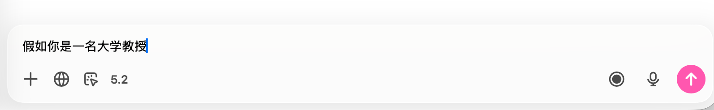
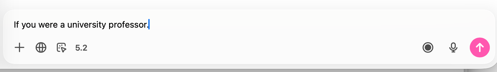

# Triple Space Translator

Language: **English** | [中文](README.zh-CN.md)

Type Chinese, press `Space` 3 times within `0.5s`, and replace it with English instantly.
Press triple-space again to toggle back to the previous language result.

## Demo

Before (Chinese input):

After (English replacement):

## Why this app

When chatting with global AI models (ChatGPT / Claude / Grok / Gemini), English prompts often produce more stable understanding and output.  
This app keeps your thinking flow: write in Chinese first, then trigger instant English replacement with triple-space.

## Features

- Triple-space trigger (`0.5s`, configurable on Windows)
- Bidirectional round-trip toggle:
  - Chinese -> English -> Chinese
  - English -> Chinese -> English
- Input replacement in common text fields
- macOS + Windows download packages
- iOS keyboard extension MVP available in repo
- Translation providers:
  - macOS / iOS: Apple Translation framework
  - Windows: OpenAI or LibreTranslate

## New: Reverse Toggle Translation

You can now translate and toggle back in the same input box:

- Type Chinese, triple-space -> English
- Triple-space again -> back to Chinese
- Type English, triple-space -> Chinese
- Triple-space again -> back to English

## Downloads

- Releases page:
  - [https://github.com/leoyoyofiona/triple-space-translator/releases](https://github.com/leoyoyofiona/triple-space-translator/releases)
- macOS (latest published package, current `v1.0.5`):
  - [DMG](https://github.com/leoyoyofiona/triple-space-translator/releases/download/v1.0.5/TripleSpaceTranslator-macOS26-universal-1.0.5.dmg)
  - [ZIP](https://github.com/leoyoyofiona/triple-space-translator/releases/download/v1.0.5/TripleSpaceTranslator-macOS26-universal-1.0.5.zip)
- Windows (latest stable installer, current `v1.0.2`):
  - [EXE](https://github.com/leoyoyofiona/triple-space-translator/releases/download/v1.0.2/TripleSpaceTranslator-Setup-1.0.2.exe)

## Platform Guides

- Windows guide:
  - `windows/README-Windows.md`
- iOS keyboard MVP guide:
  - `ios/README-iOS.md`

## macOS Local Run

1. Open this folder in Xcode as a Swift Package.
2. Run executable target `TripleSpaceTranslatorApp` on `My Mac`.
3. Grant permissions in app UI:
   - Accessibility
   - Input Monitoring
4. Restart app after first permission grant.

## Notes

- Some apps/controls may block direct replacement.
- On macOS/iOS, first translation of a language pair may require Apple language resources download.
- If replacement is blocked in protected apps, try running the Windows app as Administrator.

## CI Workflows

- macOS package workflow:
  - `.github/workflows/build-macos-installer.yml`
- Windows installer workflow:
  - `.github/workflows/build-windows-installer.yml`
