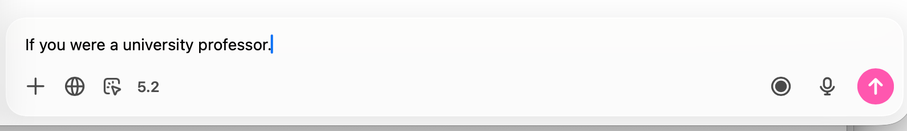
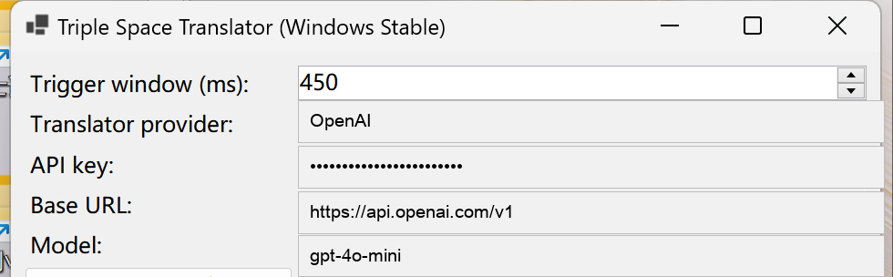

# Triple Space Translator

Language: **English** | [中文](README.zh-CN.md)

Type in Chinese or English, then press `Space` 3 times within `0.5s` to translate and replace in place.
Press triple-space again to toggle back to the previous language.

## Product Intro

Triple Space Translator is a global bilingual typing helper built for speed.
It keeps your thinking flow in chats, search boxes, and editors:

- write first in your natural language
- trigger translation with triple-space
- continue typing without copy/paste context switching

Why this matters:

- especially when using global AI models, English prompts often get more stable understanding and output
- you can keep your native-language thinking flow, then convert instantly when needed

Current highlights:

- macOS: system translation framework
- Windows: online API translation is available now (set API key in app settings; may have some latency)
- Windows offline bundled dictionary/model mode is under active development
- Bidirectional round-trip toggle:
  - Chinese -> English -> Chinese
  - English -> Chinese -> English

## UI Preview

| Chinese input | After triple-space replacement |
|---|---|
|  |  |

## Windows UI Preview

## How It Works

1. Type naturally in any text field.
2. Press `Space` 3 times within `0.5s`.
3. The current text is translated and replaced in place.
4. Press triple-space again to toggle back.

Best use cases:

- AI chats (ChatGPT / Claude / Grok / Gemini)
- browser search boxes
- messaging and quick writing
- notes and document drafting

## Downloads

- All releases:
  - [https://github.com/leoyoyofiona/triple-space-translator/releases](https://github.com/leoyoyofiona/triple-space-translator/releases)
- Download assets from the latest release:
  - macOS: `DMG / ZIP`
  - Windows: `EXE` installer

## Windows Translation Status

- Current stable Windows usage: online API translation (configure provider + API key).
- Compared with macOS Translation.framework, Windows does not have the same built-in system translation path for this app.
- Offline packaged dictionary/model mode is still being developed and improved.

## Platform Guides

- Windows guide:
  - `windows/README-Windows.md`
- iOS keyboard MVP guide:
  - `ios/README-iOS.md`

## macOS Local Run

1. Open this folder in Xcode as a Swift Package.
2. Run executable target `TripleSpaceTranslatorApp` on `My Mac`.
3. Grant permissions in app UI:
   - Accessibility
   - Input Monitoring
4. Restart app after first permission grant.

## Notes

- Some apps/controls may block direct replacement.
- On macOS/iOS, first translation of a language pair may require Apple language resources download.
- If replacement is blocked in protected apps, try running the Windows app as Administrator.

## CI Workflows

- macOS package workflow:
  - `.github/workflows/build-macos-installer.yml`
- Windows installer workflow:
  - `.github/workflows/build-windows-installer.yml`
