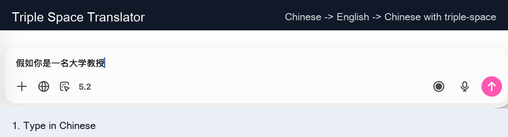

# Triple Space Translator

  
<strong>Press Space three times. Toggle Chinese and English in place.</strong>

  

    <a href="README.md">English</a> ·
    <a href="README.zh-CN.md">简体中文</a> ·
    <a href="README.ja-JP.md">日本語</a>
  

  

    
    
    
    
    
    
  

Triple Space Translator is a bilingual typing companion for AI chats, browser search boxes, and everyday editors.  
Type in Chinese or English, press `Space` `3` times within `0.5s`, and the current text is translated and replaced in place. Press triple-space again to toggle back.

## Why It Feels Useful

- Keep thinking in your natural language, then convert only when needed.
- Skip the old flow of typing, copying, opening a translator, pasting, and coming back.
- Stay in the same input box while talking to ChatGPT, Claude, Grok, Gemini, or other global AI tools.
- Use English when you want more stable parsing and output from international AI models, without losing your original Chinese drafting flow.

## Quick Preview

| Chinese input | After triple-space replacement |
|---|---|
|  |  |

## Screenshots

### Windows Settings

## Platform Status

| Platform | Status | Translation path |
|---|---|---|
| macOS | Ready | Apple `Translation.framework` |
| Windows | Ready | Online API translation in the stable build |
| Windows offline mode | In progress | Bundled Argos model package is still being completed |
| iPhone keyboard MVP | Experimental | Separate iOS project and guide |

## Downloads

- Latest release: [github.com/leoyoyofiona/triple-space-translator/releases/latest](https://github.com/leoyoyofiona/triple-space-translator/releases/latest)
- Full releases page: [github.com/leoyoyofiona/triple-space-translator/releases](https://github.com/leoyoyofiona/triple-space-translator/releases)
- macOS package: download the `DMG` or `ZIP` asset from the latest release.
- Windows package: download the `EXE` installer from the latest release.

## Best Use Cases

- ChatGPT, Claude, Grok, Gemini, and other AI chat boxes
- Browser search bars
- Messaging apps and quick replies
- Drafting notes, prompts, and short documents

## Notes

- Some apps and protected controls may block direct replacement.
- On macOS and iOS, Apple may download language resources the first time a pair is used.
- Windows stable usage currently relies on API translation, so some latency is expected.
- Windows bundled offline model mode is still under development and not the recommended stable path yet.

## Guides

- Windows guide: [windows/README-Windows.md](windows/README-Windows.md)
- iOS keyboard MVP: [ios/README-iOS.md](ios/README-iOS.md)

## Build Workflows

- macOS installer workflow: [.github/workflows/build-macos-installer.yml](.github/workflows/build-macos-installer.yml)
- Windows installer workflow: [.github/workflows/build-windows-installer.yml](.github/workflows/build-windows-installer.yml)
