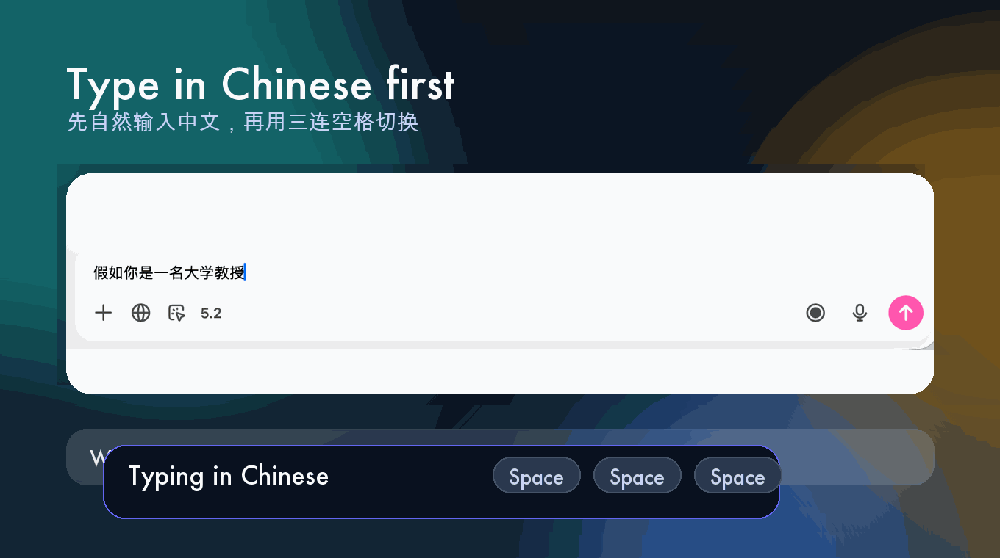

# Triple Space Translator

  
<strong>三连空格，中文英文原位切换。</strong>

  

    <a href="README.md">English</a> ·
    <a href="README.zh-CN.md">简体中文</a> ·
    <a href="README.ja-JP.md">日本語</a>
  

  

    
    
    
    
    
    
  

Triple Space Translator 是一个面向聊天框、搜索框、文档编辑器的双语输入助手。  
在任意输入框输入中文或英文后，在 `0.5 秒` 内连按 `3 次空格`，当前文本会被即时翻译并原位替换。再次三连空格，可以切回上一轮语言。

## 为什么它有吸引力

- 先按你最自然的语言写，再在需要时瞬间切换。
- 省掉“输入 -> 复制 -> 打开翻译器 -> 粘贴 -> 再复制回来”的来回折腾。
- 特别适合和国外 AI 大模型交流时使用：你可以继续用中文思考，但在同一个输入框里快速切成英文。
- 不打断思路，不离开当前窗口。

## 快速预览

| 中文输入 | 三连空格后切成英文 |
|---|---|
|  |  |

## 截图

### Windows 设置界面

## 平台状态

| 平台 | 当前状态 | 翻译方式 |
|---|---|---|
| macOS | 可用 | Apple `Translation.framework` |
| Windows | 可用 | 稳定版当前支持在线 API 翻译 |
| Windows 离线模式 | 开发中 | 内置 Argos 模型打包仍在完善 |
| iPhone 键盘 MVP | 实验中 | 独立 iOS 项目与说明 |

## 下载方式

- 最新版本入口：[github.com/leoyoyofiona/triple-space-translator/releases/latest](https://github.com/leoyoyofiona/triple-space-translator/releases/latest)
- 全部 Releases：[github.com/leoyoyofiona/triple-space-translator/releases](https://github.com/leoyoyofiona/triple-space-translator/releases)
- macOS：在最新 Release 中下载 `DMG` 或 `ZIP`
- Windows：在最新 Release 中下载 `EXE` 安装包

## Release 文案

- 英文发布文案：[release-assets/release-note-en.md](release-assets/release-note-en.md)
- 中文发布文案：[release-assets/release-note-zh-CN.md](release-assets/release-note-zh-CN.md)

## 适合哪些场景

- ChatGPT、Claude、Grok、Gemini 等 AI 对话框
- 浏览器搜索框
- 微信等聊天输入框
- 便签、提示词、短文档草稿

## 说明

- 部分 App 或受保护输入控件可能限制直接替换。
- macOS 和 iOS 首次使用某个语言对时，Apple 可能会自动下载语言资源。
- Windows 当前稳定版主要依赖在线 API 翻译，因此会受网络和接口速度影响。
- Windows 内置离线模型模式仍在开发中，目前不作为稳定主推方案。

## 详细说明

- Windows 说明：[windows/README-Windows.md](windows/README-Windows.md)
- iOS 键盘 MVP：[ios/README-iOS.md](ios/README-iOS.md)

## 自动打包

- macOS 打包工作流：[.github/workflows/build-macos-installer.yml](.github/workflows/build-macos-installer.yml)
- Windows 打包工作流：[.github/workflows/build-windows-installer.yml](.github/workflows/build-windows-installer.yml)
