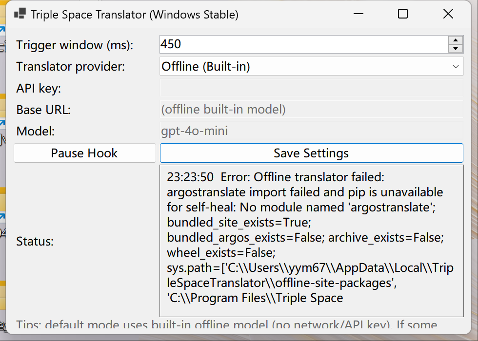
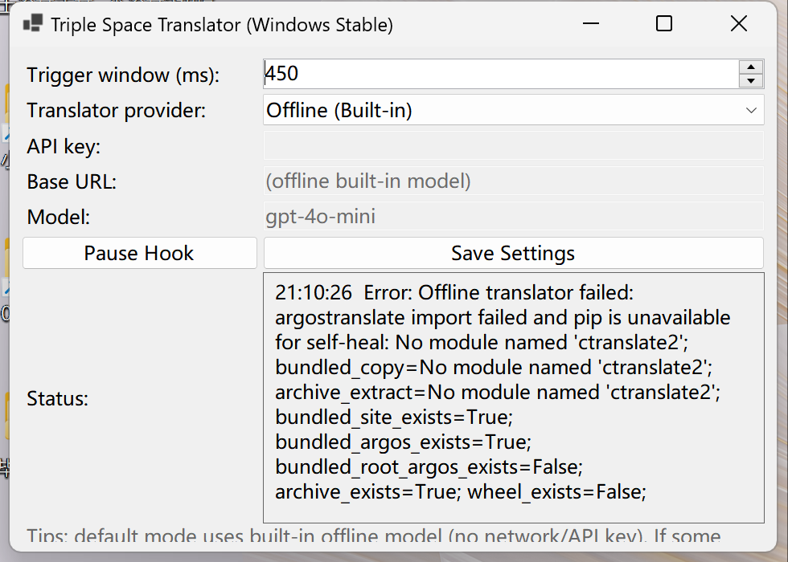

# Triple Space Translator - Windows Stable

This is the Windows stable edition of your app.

## What it does

- Global trigger: press `Space` 3 times within `0.5s` (configurable).
- Reads focused text using Windows UI Automation.
- Supports bidirectional translation and reverse toggle:
  - Chinese -> English
  - English -> Chinese
  - Press triple-space again to toggle back to the previous language result.
- Replaces text in the focused input using a fallback chain:
  - ValuePattern set
  - Selected-text typing
  - Ctrl+A/Ctrl+V clipboard replace
  - Ctrl+A + Unicode typing fallback
- Runs in system tray when minimized. Right-click tray icon for `Open / Pause Hook / Exit`.

## Windows UI Preview

| Settings UI | Status UI |
|---|---|
|  |  |

## Windows Translation Status (Important)

- Current stable usage on Windows is **online API translation**.
- You need to configure provider + API key in app settings.
- Because Windows does not provide the same built-in translation path as macOS `Translation.framework` for this app, online translation can have some latency.
- Offline bundled dictionary/model mode is still under active development and improvement.

## Translation provider

The app UI provides three provider options:

- `OpenAI` (recommended for quality)
- `LibreTranslate` (works with local/self-hosted endpoint)
- `Offline (Built-in)` (experimental/in-progress)

For stable day-to-day usage, use `OpenAI` or `LibreTranslate` online endpoint.

Configure provider/API key/base URL in app UI and click `Save Settings`.

OpenAI config example:

- `Base URL`: `https://api.openai.com/v1` (do not append `/responses`)
- `Model`: `gpt-4o-mini`

Settings file path:

- `%APPDATA%\\TripleSpaceTranslator\\settings.json`

## Optional: one-click local LibreTranslate (self-hosted)

Use local translation service on the same Windows machine:

1. Install and launch Docker Desktop.
2. Run one-click setup script:
   - `windows\\local-libretranslate\\one-click-local-libretranslate.bat`
3. The script will:
   - start local container `triple-space-libretranslate`
   - wait for `http://127.0.0.1:5000/languages`
   - auto-write app settings to:
     - provider: `LibreTranslate`
     - base URL: `http://127.0.0.1:5000/translate`
4. Restart app (or click `Save Settings` once).

Stop local service:

- `windows\\local-libretranslate\\stop-local-libretranslate.bat`

If installed via `.exe`, the Start Menu includes:

- `Enable Local LibreTranslate (One Click)`
- `Stop Local LibreTranslate`

## Build (Windows machine)

From the `windows/TripleSpaceTranslator.Win` folder:

### 1) Intel/AMD build (win-x64)

```powershell
dotnet publish -c Release -r win-x64 --self-contained true /p:PublishSingleFile=true /p:PublishTrimmed=false
```

Output example:

- `bin\\Release\\net8.0-windows\\win-x64\\publish\\TripleSpaceTranslator.Win.exe`

### 2) ARM build (win-arm64)

```powershell
dotnet publish -c Release -r win-arm64 --self-contained true /p:PublishSingleFile=true /p:PublishTrimmed=false
```

Output example:

- `bin\\Release\\net8.0-windows\\win-arm64\\publish\\TripleSpaceTranslator.Win.exe`

## Distribution notes

- Windows does not use a single universal binary for x64 + ARM64. Ship two builds.
- For best compatibility in some protected apps, users may run this app as Administrator.
- If replacement fails in a specific editor, keep that editor focused when triggering.

## Build installer (Inno Setup)

1. Install [Inno Setup 6](https://jrsoftware.org/isinfo.php) on a Windows machine.
2. Run:

```powershell
cd windows\installer
powershell -ExecutionPolicy Bypass -File .\build-installer.ps1 -AppVersion 1.0.0
```

Notes:

- This script may prepare offline runtime assets (`windows\\dist\\offline-runtime`) depending on current branch implementation.
- Build time can increase due runtime/model dependency preparation.

Installer output:

- `windows\dist\installer\TripleSpaceTranslator-Setup-1.0.0.exe`

## No local environment (recommended)

If you don't want to install anything locally, use GitHub Actions:

1. Push this project to a GitHub repository.
2. Open GitHub -> `Actions` -> `Build Windows Installer`.
3. Click `Run workflow`, set version (for example `1.0.0`), then run.
4. After workflow finishes, download from either:
   - `Artifacts` in the workflow run: `TripleSpaceTranslator-Setup-<version>`
   - `Releases` page: direct `.exe` asset under tag `v<version>`
